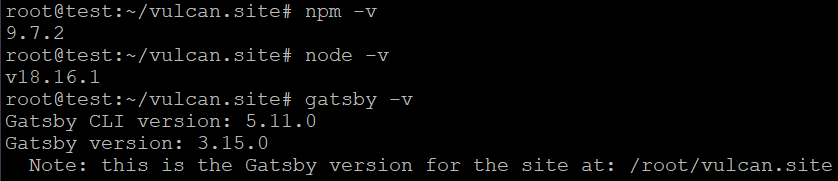
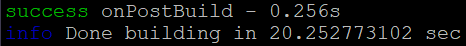
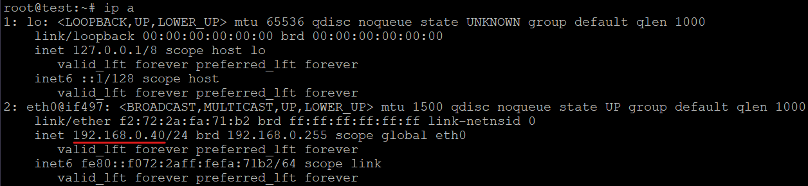
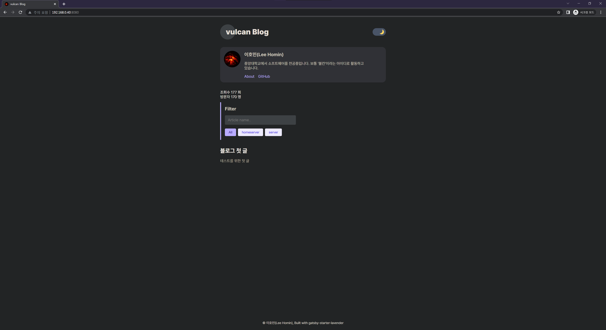
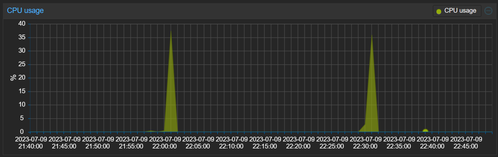

# 0. 시작하기에 앞서

이 블로그는 [이창희](https://xo.dev/)님이 만든 [gatsby-starter-lavender](https://github.com/blurfx/gatsby-starter-lavender) 블로그 테마와 [김성현](https://witch.work/)님의 [gatsby-starter-lavender](https://github.com/witch-factory/witch-blog)를 기반으로 작성되었다.

다른 블로그의 글들을 참고하면서 항상 리눅스 커맨드의 의미에 대해서 잘 모르고 무지성으로 ctrl CV를 해왔던 것 같다. 어느 정도 심도 있는 글이 아닌 이런 튜토리얼에 가까운 글에서는 커맨드의 의미에 대해서 간단하게라도 설명하는 부분이 있었으면 좋을 것 같다고 언제나 생각해 왔다. 적어도 이번 튜토리얼에서는 그동안 생각해 왔던 것을 실천할 예정이다.

# 1. 환경

[블로그 첫 글](https://vulcan.site/first_article/)을 보면 알 수 있듯이 나는 집에서 proxmox가 올라간 서버를 굴리고 있다. 때문에 proxmox에서 제공하는 ubuntu-20.04-standard_20.04-1_amd64 템플릿에서 진행하였다. lxc container는 unprivileged mode로 생성하였다. 아마 대부분의 linux 환경에서 동작하는데 문제는 없을 것이라고 생각한다. 로컬서버가 있다면 활용해도 되고, 클라우드 서비스를 이용해도 된다.

이 글에서는 Vercel, Netlify, Gatsby Cloud등을 활용해서 Deploy하는 방법에 대해선 소개하지 않는다. 추후에 기회가 된다면 이 방법들도 소개해 보도록 하겠다.

# 2. 설치

아래 커맨드를 따라가면 된다.

```sh
adduser USERNAME                    //유저 추가
usermod -aG sudo USERNAME           //sudo 그룹에 추가(이 아래는 추가한 유저로 진행)
```
"USERNAME"은 유저 이름이다.
```sh
sudo apt update && sudo apt upgrade
sudo apt install git                //깃 설치
git clone YOUR_GIT_URL              //git repo에서 git clone
cd MY_BLOG_STARTER/                 //clone한 repo로 이동
sudo apt install npm                //npm 설치
sudo npm install -g n               //nodejs 버전관리 플러그인
sudo n lts                          //lts 버전
sudo n prune                        //이전 버전 삭제
sudo npm install                    //패키지 설치
sudo npm install -g npm@latest      //npm 최신 버전
sudo npm install -g gatsby-cli      //gatsby 설치
gatsby build                        //gatsby build
```
"YOUR_GIT_URL"은 생성한 깃 레포지토리의 주소이다.

"MY_BLOG_STARTER"는 클론된 디렉토리이다.

사용된 버전



아래와 같이 빌드되면 성공이다



빌드가 성공하면 해당 디렉토리에 public 디렉토리가 생성된다.

# 3. nginx 설정

웹서버로 nginx를 사용해서 정적 웹페이지를 띄워준다.

```sh
sudo apt install nginx                              //nginx 설치
sudo nano /etc/nginx/sites-available/static.site    //설정파일 편집
```
아래 설정을 복붙해준다.
```nginx
server {
        listen       YOUR_PORT_NUMBER;
        server_name  0.0.0.0;
        charset      utf-8;
        index        index.htm index.html;
        root         YOUR_PUBLIC_FILE_PATH;
}
```
"YOUR_PORT_NUMBER"를 원하는 포트 번호로, YOUR_PUBLIC_FILE_PATH를 빌드된 public 디렉토리 경로로 바꿔야한다.
```sh
sudo ln -s /etc/nginx/sites-available/static.site /etc/nginx/sites-enabled/     //링크
sudo nginx -t                                                                   //테스트
sudo service nginx reload                                                       //nginx reload
```
```sh
ip a
```


위 커맨드를 쳐서 나오는 아이피 + 위에 설정한 포트 번호로 접속하면 된다.



잘 나오는 것을 볼 수 있다.

# 4. crontab 설정

작성한 글은 깃허브에 올라가게 된다. 다만 글을 쓸때마다 서버에 접속해서 git pull을 하고 gatsby build를 해주는 것을 번거로운 일이다. 때문에 이것을 crontab과 간단한 스크립트로 자동화하도록 하자.

```sh
sudo nano MY_BLOG_STARTER/build.sh      //build 스크립트 작성
```
아래 스크립트로 복붙한다.
```sh
git pull
gatsby build
```
```sh
sudo nano /etc/crontab                  //crontab 수정
```
맨 밑에 아래 명령어를 복붙한다.
```sh
*/30 * * * * USERNAME cd MY_BLOG_STARTER && bash build.sh   //30분 마다 실행된다.
```
"USERNAME"은 유저 이름이다.

"MY_BLOG_STARTER"는 클론된 디렉토리이다.
```sh
sudo service cron reload                //cron reload
```

proxmox의 CPU모니터링 그래프를 보면 30분마다 실행되고 빌드가 되면서 CPU 사용량이 올라가는 것을 볼 수 있다.



# 참고

https://www.wsgvet.com/staticsite/18

https://study-melody.tistory.com/45

https://happist.com/553442/%EC%84%9C%EB%B2%84%EC%97%90%EC%84%9C-%EC%9E%90%EB%8F%99-%EC%8B%A4%ED%96%89%EC%9D%84-%EA%B0%80%EB%8A%A5%EC%BC%80-%ED%95%B4%EC%A3%BC%EB%8A%94-crontab%ED%81%AC%EB%A1%A0%ED%83%AD-%EC%84%A4%EC%A0%95