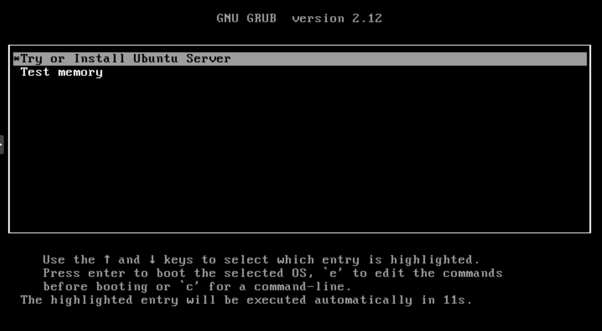
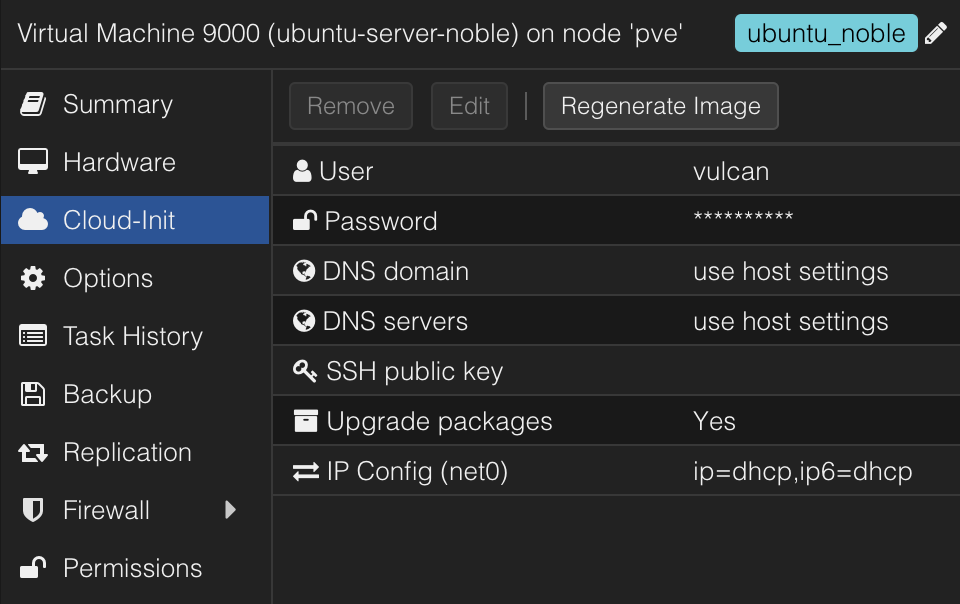
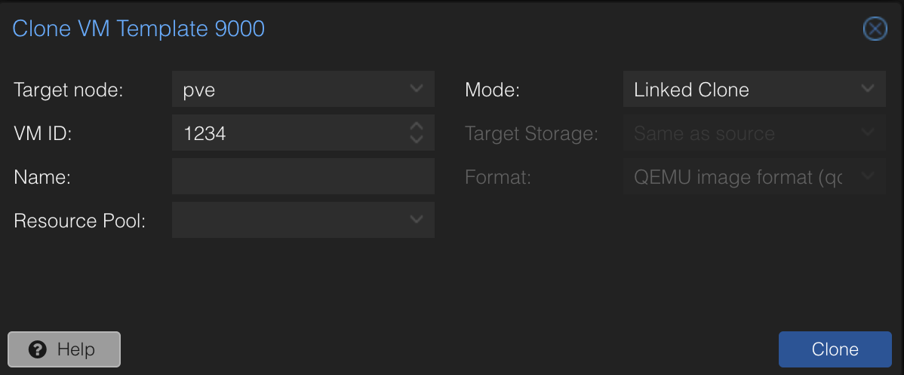

# 시작
proxmox를 벌써 3년 정도 사용하면서 많은 vm을 생성하고 삭제했다. 하지만 매번 vm을 생성할 때마다 같은 설정들을 반복했다는 걸 느꼈다. ssh key를 넣어주고, apt 저장소를 kakao mirror로 바꾸고, 필요할 경우 고정 ip를 할당하는 등의 것들이다. 하지만, 이 세팅들을 매번 하는 것도 질렸고, 무엇보다 이번에 k8s 클러스터를 구축하면서 동일한 설정과 동일한 패키지를 가지는 여러 vm을 생성해야 했다. 1n 개 이상의 vm을 이런 식으로, 수동으로 설정하는 것은 바보 같은 짓이라는 생각이 들었다.

물론 [proxmox](https://www.proxmox.com)에도 [Template](https://pve.proxmox.com/wiki/VM_Templates_and_Clones)라는 기능이 존재한다. Packer도 결과적으로 Template를 만드는 것이지만, proxmox만으로 이것을 하려면 직접 VM을 설치하고 세팅하여 이후에 이것을 Template으로 전환해야 하고, 만약 실수한다면 이 고정을 다시 해야 한다. 그 때문에 IaC도구의 힘을 빌리기로 했다. [HashiCorp](https://www.hashicorp.com)의 [Packer](https://www.hashicorp.com/products/packer)와 [Terraform](https://www.hashicorp.com/products/terraform), 그리고 [Ansible](https://github.com/ansible/ansible)을 사용하여 이 과정을 자동화하고자 한다. 이 글을 그 과정 중 첫 번째인 Packer에 대해서 간단하게 설명하고, proxmox에서 Packer로 기본적인 설정이 완료된 ubuntu 24.04, 22.04이미지를 만들어보고자 한다.

# 1. Packer란?
Packer는 이미지 빌드를 자동화해 주는 오픈소스 소프트웨어이다. 서버나 가상머신, 클라우드 인스턴스와 같은 환경에서 일관되고, 반복적인 배포를 할 때 유용하다. Template를 이용해서 항상 같은 이미지를 빌드하기 때문에 개발, 테스트, 프로덕션 환경을 일관적으로 유지할 수 있다. 또한 반복적인 작업을 줄일 수 있다. 만약 각 vm에 k8s 관련 패키지를 Ansible로 설치한다고 생각하면, 각 VM에 SSH로 접속해서 설치 스크립트를 실행할 것이고, 더 높은 네트워크 사용과 미리 설치해 둔 패키지를 설치하는 것보다는 당연히 클러스터의 배포가 느려질 것이다.

이처럼 Packer는 DevOps 파이프라인의 가장 앞에서 가장 필수적이고 공통적인 패키지를 포함한 이미지를 미리 만들어둠으로써 배포 시간을 줄이고, 일관성을 유지할 수 있게 해준다. 이는 홈서버를 운영하는 입장에서도 매우 편리하다. 앞서 말한 ssh key, kakao mirror etc...들을 매번 세팅하는 건 매우 귀찮은 일이다. 특히 지인들과 서버를 공유하고 있다면 더욱 귀찮은 일이다. 이제 이 귀찮음을 해결해 보자.

# 2. 설치
기본적으로 Packer의 설정에 관한 문서는 [여기](https://developer.hashicorp.com/packer)에 아주 잘 정리돼 있다. ubuntu server noble에 설치할 거기 때문에 이 [튜토리얼](https://developer.hashicorp.com/packer/install#linux)을 따라 하자.
```sh
wget -O - https://apt.releases.hashicorp.com/gpg | sudo gpg --dearmor -o /usr/share/keyrings/hashicorp-archive-keyring.gpg
echo "deb [arch=$(dpkg --print-architecture) signed-by=/usr/share/keyrings/hashicorp-archive-keyring.gpg] https://apt.releases.hashicorp.com $(lsb_release -cs) main" | sudo tee /etc/apt/sources.list.d/hashicorp.list
sudo apt update && sudo apt install packer
```
설치가 완료되고 `packer --version`을 입력했을 때
```sh
~$ packer --version
Packer v1.12.0
```
이런 식으로 나온다면 설치가 완료된 것이다.

# 3. 폴더 구성
Packer를 이용해서 proxmox를 빌드하기 위해서는 packer Template에 사용될 폴더와 proxmox에 접속하기 위한 credentials를 저장할 파일이 필요하다. 그리고 이미지를 생성할 템플릿, ssh user의 credentials 파일, 설치 시 전달한 user data가 필요하다. 때문에 아래와 같이 폴더를 구성해서 jammy와 noble을 위한 Template를 작성할 것이다.
```css
packer/
├── ubuntu-server-jammy/
│   ├── files/
│   │   └── 99-pve.cfg
│   ├── http/
│   │   ├── meta-data
│   │   └── user-data
│   ├── run-packer.sh
│   ├── ssh-user-credentials.pkr.hcl
│   └── ubuntu-server-jammy.pkr.hcl
├── ubuntu-server-noble/
│   ├── files/
│   │   └── 99-pve.cfg
│   ├── http/
│   │   ├── meta-data
│   │   └── user-data
│   ├── run-packer.sh
│   ├── ssh-user-credentials.pkr.hcl
│   └── ubuntu-server-noble.pkr.hcl
└── credentials.pkr.hcl
```
`run-packer.sh`는 validate와 build를 편하게 하기 위해서 작성했다.

# 4. 파일 설정
ubuntu server noble(24.04.x)를 기준으로 진행하겠다.
## 4.1. credentials.pkr.hcl
Packer가 proxmox에서 VM을 생성하고, 설정값을 입력하고, 이것을 template로 바꾸기 위해서는 어떤 방법으로든 proxmox의 쉘에 접속할 수밖에 없다. 이를 위해서 proxmox의 api_url, username과 password 혹은 token이 필요하다.(passward나 token 중 하나만 있어도 된다.) 이는 모든 template 파일에 포함돼야 하는데, 편의를 위해서 root 권한을 그대로 사용한다. 그 때문에 credentials 파일에서 username, password, token, api_url을 변수로 저장하고, 일관적으로 관리하려고 한다.(Packer를 위한 proxmox의 권한에 관련된 문서는 찾지 못했지만, 권한과 관련된 보안 이슈를 해결할 만한 솔루션을 발견했다. 해당 [이슈](https://github.com/hashicorp/packer-plugin-proxmox/issues/184)에 따라 pool, group, user를 생성하고 적절히 권한을 주고 Packer가 proxmox Template를 완전히 생성한 뒤 root 권한으로 원하는 pool로 생성된 Template를 이동시키면 될 듯하다.) 아래와같이 `credentials` 파일을 작성해 준다.
```sh
# proxmox API credentials
proxmox_api_url             = "https://YOUR_PROXMOX_IP:8006/api2/json"
proxmox_api_token_id        = "YOUR_USERNAME@REALM_NAME!tokenid"
#token을 사용할거면 !tokenid를 뒤에 붙여줘야함 e.g. root@pam!packer
proxmox_api_password        = "YOUR_PASSWORD"   #token을 사용할거면 비워도도 됨
proxmox_api_token_secret    = "TOKEN_SECRET"    #password를 사용할거면 비워도도 됨
```
되도록 `token`을 사용하도록 하자.

## 4.2. ssh-user-credentials.pkr.hcl
Packer가 VM을 생성하고, 이후에 VM에 접속해서 provisioner로 필요한 패키지를 설치하기 위해서는 해당 VM에 ssh로 접속해야 한다. 이를 위해서 `user-data`에 입력한 user와 동일한 데이터가 필요하다. 이 값도 예제 아래에 작성한 이유로 Template에서 유일하게 자주 변경해야 할 수도 있기 때문에 변수로 분리했다. 아래와같이 `ssh-user-credentials` 파일을 작성해 준다.
```sh
# ssh credentials
ssh_username                = "YOUR_USERNAME"   #e.g. packer
ssh_password                = "YOUR_PASSWORD"   #ssh key를 사용한다면 비워도도 됨
ssh_private_key_file_path   = "YOUR_PRIVATE_SSH_KEY_PATH"   #Packer가 설치돼있는 host의 path임 e.g. ~/.ssh/packer
```
이때 빌드를 위한 packer user와 ssh key를 입력해 두고, 나중에 Terraform 등을 이용해서 지워도 된다. 하지만 많은 VM을 생성하지 않을 때는 수동으로 clone 하므로, 이 user가 거슬릴 수 있다. 예제에서는 packer라는 user로 진행했지만, 이를 자주 사용하는 user와 ssh key로 변경해도 된다.

[문서](https://developer.hashicorp.com/packer/integrations/hashicorp/proxmox/latest/components/builder/iso)대로라면 `ssh_password`를 이용해서도 접속할 수 있어야 하지만 나의 경우 오직 ssh key로만 접속할 수 있었다.

## 4.3. user-data
이 `user-data`에 관해서 설명하려면 먼저 cloud-init에 대해서 알아야 한다. cloud-init은 VM 혹은 클라우드 인스턴스의 초부팅 시 사용자 지정 스크립트/환경 설정을 자동 적용해 주는 툴이다. proxmox에도 cloud-init을 설정해서 부팅 시 적용할 수 있는 옵션이 있다. 하지만 Packer는 이 방식을 사용하지 않고, 직접 임시로 HTTP 서버를 구동한다. 그리고 아래에서 작성할 template 코드에서 부팅시 옵션을 입력하는데, 이것이 Packer가 임시로 구동한 HTTP 서버에 접속해 `user-data`와 `meta-data`를 가져온다. 여기서는 http 폴더 아래에 있는 두 파일이 된다. 이 과정을 거치면서 VM은 설치 시에 `user-data`에 기술된 user를 생성하게 되고, 이후에 부팅했을 때 ssh로 접속하는 것이다. 위에서 작성한 `ssh-user-credentials`로 ssh 접속을 시도하기 때문에 대응하는 값으로 `user-data`파일을 작성해 준다.
```json
#cloud-config
autoinstall:
  version: 1
  locale: en_US
  keyboard:
    layout: us
  ssh:
    install-server: true
    allow-pw: true
    disable_root: true
    ssh_quiet_keygen: true
    allow_public_ssh_keys: true
  packages:
    - qemu-guest-agent
    - sudo
  storage:
    layout:
      name: direct
    swap:
      size: 0
  user-data:
    package_upgrade: false
    timezone: Asia/Seoul
    users:
      - name: YOUR_USERNAME
        groups: [adm, sudo]
        lock-passwd: false
        sudo: ALL=(ALL) NOPASSWD:ALL
        shell: /bin/bash
        #passwd: YOUR_PASSWORD
        # - or -
        ssh_authorized_keys:
          - YOUR_SSH_PUBLIC_KEY
```
위에서 작성한 `ssh-user-credentials`의 `YOUR_USERNAME`과 같은 username을 적어주고, `YOUR_PRIVATE_SSH_KEY_PATH`에 대응하는 public key를 적어주면 된다. 부팅하면서 최신 패키지를 적용하고 싶다면 `package_upgrade`를 true로 바꿔주면 된다.

## 4.4. ubuntu-server-noble.pkr.hcl
가장 핵심이 되는 template 파일이다. proxmox에서 VM을 실행하고 빌드하고 템플릿으로 바꿔주는 파일이다. 파일에서 사용한 값에 대한 상세나, 추가 값들은 [여기](https://developer.hashicorp.com/packer/integrations/hashicorp/proxmox/latest/components/builder/iso)에서 확인하면된다. 이 파일은 상당히 길기 때문에 나눠서 진행하겠다.

### 4.4.1. Variable 정의
앞서 작성한 `credentials`, `ssh-user-credentials` 두 파일에서 작성한 variable들에 대한 정의를 해줘야 한다. 각 type은 [여기](https://developer.hashicorp.com/packer/integrations/hashicorp/proxmox/latest/components/builder/iso)에 적혀있는 type에 따라서 작성하면 된다. password는 사용하지 않는다면 이 부분과 아래에서 이 변수를 사용하는 부분 모두를 지워줘도 된다.
```json
# Variable Definitions
variable "proxmox_api_url" {
    type = string
}
variable "proxmox_api_token_id" {
    type = string
}
variable "proxmox_api_password" {
    type = string
    sensitive = true
}
variable "proxmox_api_token_secret" {
    type = string
    sensitive = true
}
variable "ssh_username" {
    type = string
}
variable "ssh_password" {
    type = string
    sensitive = true
}
variable "ssh_private_key_file_path" {
    type = string
}
```

### 4.4.2. Resource 정의
여기서 사용되는 값들에 대한 상세는 다시 말하지만 [여기](https://developer.hashicorp.com/packer/integrations/hashicorp/proxmox/latest/components/builder/iso)를 참고하자.
* `source`의 `proxmox-iso`는 type이기 때문에 그대로 작성해야 한다.
* `Proxmox Connection Settings`는 앞에 서술했듯이 proxmox에 접속해서 VM을 생성하고 설치 과정을 진행하기 위해서 선언해야 하는 값이다.
  * `insecure_skip_tls_verify`의 경우 valid한 TLS인증서가 달려있는 `proxmox_url`를 사용한다면 생략해도 된다.
* `ssh Settings`는 생성된 VM에 접속해서 빌드 과정을 진행하기 위해서 ssh 접속을 위해서 선언해야 하는 값이다.
* `VM General Settings`는 VM을 생성할 때 사용되는 기본적인 값이다.
  * `node`의 경우 클러스터 구성이 아니라면 지정해 줄 필요는 없다.
  * `bios`값의 경우 default는 seabios이다. 그런데 이 값을 ovmf로 할 경우 efi_config로 efi disk를 지정해 줘야 하는데, 이 경우 [proxmox에서 live migration을 진행할 수 없게 되니](https://bugzilla.proxmox.com/show_bug.cgi?id=3227) 주의해야한다.(이 [스레드](https://forum.proxmox.com/threads/why-cant-proxmox-live-migrate-an-efi-disk.152941/)를 보면 해당 이슈가 아직도 존재하는것으로 보이고, 실제로 나도 실패했다.)
* `VM OS Settings`는 proxmox에서 OS가 저장된 저장소의 위치를 정의한다. 추가적인 디스크를 추가하지 않았다면 아마도 `local`일 것이다. 이 경우라면 `YOUR_ISO_STORAGE_POOL`를 local로 하면 된다. 그리고 [ubuntu-24.04.1-live-server-amd64.iso](https://releases.ubuntu.com/24.04.1/ubuntu-24.04.1-live-server-amd64.iso?_ga=2.174163618.1627445440.1739895538-2098516798.1731756258&_gl=1*1ijd3p4*_gcl_au*NDYzMTY4OTQ3LjE3Mzk4OTU1Mzg.)를 해당 저장소에 받아둬야 한다.
* `VM Hard Disk Settings`는 VM의 디스크 설정이다.
* `VM Network Settings`는 네트워크 설정이다. `vlan_tag`의 경우 해당 VLAN과 Packer host 사이에 방화벽이 있어서 ssh 접속이 불가능하진 않은지 확인해야한다.
* `VM Cloud-Init Settings`는 다음에 Terraform이나 직접 cloud-init 값을 입력하기 위해서 필요한 proxmox용 cloud-init disk를 생성하는 과정이다.
* `PACKER Boot Commands`는 앞서 설명했듯이 부팅 시에 Packer host의 임시 http 서버에 접속해서 cloud-init 정보를 가져오기 위한 커맨드이다.
* `PACKER Autoinstall Settings`는 방금 설명한 임시 http 서버에 대한 설정이다. 여기서 만약 `http_port_min`, `http_port_max`가 똑같이 설정된 여러 Packer template를 동시에 build 한다면 문제가 발생할 수 있다.
```sh
# Resource Definiation for the VM Template
source "proxmox-iso" "ubuntu-server-noble" {

    # Proxmox Connection Settings
    proxmox_url = "${var.proxmox_api_url}"
    username    = "${var.proxmox_api_token_id}"
    password    = "${var.proxmox_api_password}"
    token       = "${var.proxmox_api_token_secret}"
    insecure_skip_tls_verify = true # (Optional) Skip TLS Verification

    # ssh Settings
    ssh_username                = "${var.ssh_username}"
    # (Option 1) Add your Password here
    #ssh_password                = "${var.ssh_password}"
    # - or -
    # (Option 2) Add your Private SSH KEY file here
    ssh_private_key_file        = "${var.ssh_private_key_file_path}"
    ssh_clear_authorized_keys   = true
    ssh_timeout                 = "30m"
    ssh_handshake_attempts      = 50
    ssh_pty                     = true

    # VM General Settings
    template_description = "Ubuntu Server Noble Image"
    node        = "pve"
    vm_id       = "9000"
    vm_name     = "ubuntu-server-noble"
    #pool        = ""
    tags        = "ubuntu_noble"
    os          = "l26"
    machine     = "q35"
    qemu_agent  = true
    cores       = "2"
    memory      = "4096"
    #bios        = "ovmf"
    #efi_config {
    #    efi_storage_pool    = "YOUR_STORAG_POOL" #e.g. local-lvm
    #    efi_type            = "4m"
    #    pre_enrolled_keys   = true
    #}

    # VM OS Settings
    boot_iso {
      type              = "scsi"
      iso_file          = "YOUR_ISO_STORAGE_POOL:iso/ubuntu-24.04.1-live-server-amd64.iso"  #iso file name
      iso_storage_pool  = "YOUR_ISO_STORAGE_POOL" #local
      unmount           = true
    }

    # VM Hard Disk Settings
    scsi_controller     = "virtio-scsi-pci"
    disks {
        disk_size       = "20G"
        format          = "raw"
        storage_pool    = "YOUR_STORAG_POOL"  #e.g. local-lvm
        type            = "virtio"
    }

    # VM Network Settings
    network_adapters {
        model       = "virtio"
        bridge      = "vmbr1"
        #vlan_tag    = "100"
        firewall    = "false"
    }

    # VM Cloud-Init Settings
    cloud_init              = true
    cloud_init_storage_pool = "YOUR_STORAG_POOL"  #e.g. local-lvm

    # PACKER Boot Commands
    boot_command = [
        "<esc><wait>",
        "e<wait>",
        "<down><down><down><end>",
        "<bs><bs><bs><bs><wait>",
        "autoinstall ds=nocloud-net\\;s=http://{{ .HTTPIP }}:{{ .HTTPPort }}/ ---<wait>",
        "<f10><wait>"
    ]
    boot                    = "c"
    boot_wait               = "10s"
    communicator            = "ssh"

    # PACKER Autoinstall Settings
    http_directory          = "http"
    # (Optional) Bind IP Address and Port
    http_bind_address       = "YOUR_PACKER_HOST_IP" #packer host IP
    http_port_min           = 8802
    http_port_max           = 8902
}
```

### 4.4.3. Build 정의
VM생성 이후 ssh로 접속해서 실행할 커맨드이다. 여기서 `sources`는 위의 template에서 `source`와 대응하게 작성해야 한다. 여기서는 이후에 proxmox의 cloud-init 저장소를 활용하기 위한 준비와, 나의 경우 apt 저장소를 kakao로 변경하는 작업을 추가했다.
```sh
# Build Definition to create the VM Template
build {

    name    = "ubuntu-server-noble"
    sources = ["source.proxmox-iso.ubuntu-server-noble"]

    # Provisioning the VM Template for Cloud-Init Integration in Proxmox #1
    provisioner "shell" {
        inline = [
            "while [ ! -f /var/lib/cloud/instance/boot-finished ]; do echo 'Waiting for cloud-init...'; sleep 1; done",
            "sudo rm /etc/ssh/ssh_host_*",
            "sudo truncate -s 0 /etc/machine-id",
            "sudo apt -y autoremove --purge",
            "sudo apt -y clean",
            "sudo apt -y autoclean",
            "sudo cloud-init clean",
            "sudo rm -f /etc/cloud/cloud.cfg.d/subiquity-disable-cloudinit-networking.cfg",
            "sudo rm -f /etc/netplan/00-installer-config.yaml",
            "sudo sync"
        ]
    }

    # Provisioning the VM Template for Cloud-Init Integration in Proxmox #2
    provisioner "file" {
        source      = "files/99-pve.cfg"
        destination = "/tmp/99-pve.cfg"
    }

    # Provisioning the VM Template for Cloud-Init Integration in Proxmox #3
    provisioner "shell" {
        inline = [ "sudo cp /tmp/99-pve.cfg /etc/cloud/cloud.cfg.d/99-pve.cfg" ]
    }

    # Change apt repo to kakao mirror
    provisioner "shell" {
        inline = [
            "sudo sed -i 's|http://kr.archive.ubuntu.com/ubuntu/|http://mirror.kakao.com/ubuntu/|g' /etc/apt/sources.list.d/ubuntu.sources"
        ]
    }

    # Add additional provisioning scripts here
    # ...
}
```
ubuntu server noble과 jammy 모두 지금까지의 값들은 당연한 이름 같은 것을 제외하면 모두 동일하다. 하지만 ubuntu 24.04버전으로 오면서 apt 저장소 리스트를 저장하는 위치가 약간 바뀌었다. `/etc/apt/sources.list -> /etc/apt/sources.list.d/ubuntu.sources` 때문에 jammy의 경우 아래와같이 apt 저장소를 바꾸는 코드만 수정해 주면 된다.
```sh
    # for ubuntu server jammy
    # Change apt repo to kakao mirror
    provisioner "shell" {
        inline = [
            "sudo sed -i 's|http://kr.archive.ubuntu.com/ubuntu/|http://mirror.kakao.com/ubuntu/|g' /etc/apt/sources.list"
        ]
    }
```

### 4.4.4. 나머지
`meta-data`의 경우 필요하다면 사용하면 된다. 여기서는 아무것도 작성하지 않아도 된다.
`99-pve.cfg`에는 `datasource_list: [ConfigDrive, NoCloud]` 한 줄만 있으면 되는데, 이것은 부팅 시에 cloud-init이 ConfigDrive를 먼저 진행할지, NoCloud로 먼저 진행할지를 정의하는 부분이다. proxmox의 경우 NoCloud방식을 사용한다. ConfigDrive를 먼저 확인하고 없다면 proxmox의 설정을 따르게 된다.

# 4.4.5. run-packer.sh
```sh
#!/bin/bash

ACTION=$1
TEMPLATE_FILE=$2

if [ -z "$TEMPLATE_FILE" ]; then
    echo "Usage: $0 {validate|build|-v|-b} <template-file>"
    exit 1
fi

if [ "$ACTION" == "validate" ] || [ "$ACTION" == "-v" ]; then
    packer validate -var-file ../credentials.pkr.hcl -var-file ./ssh-user-credentials.pkr.hcl "$TEMPLATE_FILE"
elif [ "$ACTION" == "build" ] || [ "$ACTION" == "-b" ]; then
    packer build -var-file ../credentials.pkr.hcl -var-file ./ssh-user-credentials.pkr.hcl "$TEMPLATE_FILE"
else
    echo "Usage: $0 {validate|build|-v|-b} <template-file>"
    exit 1
fi
```
빌드의 편의를 위해 작성한 파일이다. 앞서 작성된 Packer 파일들을 빌드하기 위해서는
```sh
packer build -var-file ../credentials.pkr.hcl -var-file ./ssh-user-credentials.pkr.hcl ubuntu-server-noble.pkr.hcl
```
를 입력해야 한다고 했다. 이 스크립트는 반복되는 variable 파일을 이미 넣어둬서 
```sh
./run-packer.sh -b ubuntu-server-noble.pkr.hcl
```
로 진행할 수 있다. validate의 경우
```sh
./run-packer.sh -v ubuntu-server-noble.pkr.hcl
```

# 5. 빌드
위의 `run-packer` 스크립트를 이용해서 빌드해도 되지만, 일단은 정석적인 방법으로 빌드하려고 한다. 일단 Packer의 proxmox plugin을 설치해 준다.
```sh
~$ packer plugins install github.com/hashicorp/proxmox
Installed plugin github.com/hashicorp/proxmox v1.2.2 in "/home/user/.config/packer/plugins/github.com/hashicorp/proxmox/packer-plugin-proxmox_v1.2.2_x5.0_linux_amd64"
```
위와 같이 뜬다면 성공적으로 설치된 것이다.

`packer build`를 하기 이전에 validate 과정을 거쳐서 template 코드가 정상적으로 작성됐는지 확인해야 한다.
```sh
~$ packer validate -var-file ../credentials.pkr.hcl -var-file ./ssh-user-credentials.pkr.hcl ubuntu-server-noble.pkr.hcl
The configuration is valid.
```
위와 같이 뜬다면 성공적으로 validate 된 것이다.

validate가 성공했다면 비슷한 명령으로 build를 해준다.
```sh
~$ packer build -var-file ../credentials.pkr.hcl -var-file ./ssh-user-credentials.pkr.hcl ubuntu-server-noble.pkr.hcl
```
빌드를 하면 proxmox웹에서 지정한 vmid로 VM이 생성되고 부팅되는 걸 확인할 수 있다. 이때 아래와 같은 화면에서 절대 다른 조작을 해서는 안 된다. 이 화면에서 Packer가 proxmox에 키보드 입력을 통해 Packer가 띄운 http서버에서 cloud-init 정보를 가져오기 위한 커맨드를 입력하는데, 오조작으로 바로 설치 환경으로 들어가게 되면 Packer가 이후 프로세스를 진행할 수 없게 된다.

성공적으로 빌드가 완료되면 아래와 같이 proxmox Template가 생성된 것을 확인할 수 있다.


# 6. clone
이제 proxmox에 생성된 이미지를 clone 해보자. clone 하기에 앞서 proxmox에서 cloud-init 설정을 해줘야 한다.

위와 같이 User, Password, SSH public key를 넣어주고, IP Config는 기본으로 dhcp로 설정해 주면 된다. 이후에 다룰 Terraform으로 VM 여러 개 배포하기에서 고정 IP로 생성하는 방법에 대해서 자세히 다루겠다. 값을 다 넣었다면 VM을 우클릭하거나 우측 상단의 more에서 clone을 찾아서 clone을 진행한다.

위와 같은 창이 뜰 것이다. 여기서 VM ID, Name 등을 넣어주고, Mode를 지정해 줘야 한다. 여기서 Linked Clone과 Full Clone이 있는데, Linked Clone은 원본 이미지에 의존해서 VM을 생성하기 때문에 디스크 공간을 절약하고 더 빠른 Clone을 할 수 있지만, 원본 이미지의 안정성이 보장돼야 한다. 또한 Linked Clone을 하면 link 돼 있는 이미지(예제에선 VM ID 9000)와 같은 디스크에 clone 된 VM이 존재해야 한다. replication을 적용한 상태의 서로다른 proxmox 노드로의 migration은 시도해 보진 않았지만, replication 없이 migration을 진행했을 때는 실패했으니 다른 노드로 migration 할 계획이 있다면 Full Clone을 권장한다. 보통의 경우라면 테스트할 때는 linked로 장기간 사용할 계획이라면 full을 추천한다.

# 결론
앞으로는 생성된 이미지를 가지고 편하게 초기 세팅이 완료된 VM을 clone으로 생성해서 바로 사용할 수 있을 것이다. Packer를 이용해서 이미지를 만들고 이 이미지로 VM을 생성하는 방식은 그냥 OS 이미지로 부팅하고 생성하는 것보다 훨씬 편하고 일관적이다. proxmox를 사용을 굉장히 편리하게 해줘서 이 경험을 최대한 자세히 공유하고자 노력했고, 많은 사람들이게 도움이 됐으면 한다.

다음 글에서 Terraform으로 같은 이미지를 사용해서 k8s cluster를 위한 VM 여러 개를 배포하는 과정을 설명하려고 한다.

잘못된 설명이나 추가로 설명했으면 좋겠는 부분, 오타, 맞춤법에 대한 지적은 언제나 환영합니다.

# 참고
[ChristianLempa](https://github.com/ChristianLempa) github/boilerplates

https://github.com/ChristianLempa/boilerplates/tree/main/packer/proxmox

[HashiCorp Packer](https://www.hashicorp.com/ko/products/packer) developer docs

https://developer.hashicorp.com/packer/integrations/hashicorp/proxmox