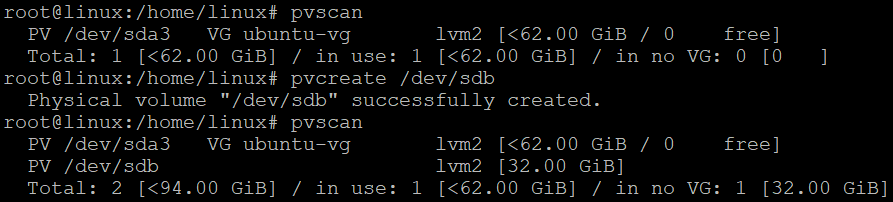

# 0 환경

-   proxmox 7.4
-   ubuntu 20.04 VM
-   확장하기 전 상태는 아래와 같다.


# 1 과정

-   우분투 머신에 디스크를 추가해준다.

```sh
sudo su
fdisk -l | grep "/dev/sd"
```

-   추가한 디스크 확인


-   pvscan해서 확인 후 `pvcreate`로 추가한 디스크를 볼륨에 추가한다.

```sh
pvscan
pvcreate /dev/sdb
pvscan
```



-   이후 `vgextend`로 VG에 추가해줍니다.

```sh
vgextend ubuntu-vg /dev/sdb
```


-   `lvscan`으로 용량을 확장할 lvm의 경로를 확인합니다.

```sh
lvscan
```


-   `lvextend -l +100%FREE -n [lvm 경로]`로 확장.

```sh
lvextend -l +100%FREE -n /dev/ubuntu-vg/ubuntu-lv
```


-   `resize2fs`로 확장.

```sh
resize2fs /dev/ubuntu-vg/ubuntu-lv
```


-   `df -h`로 확장됐는지 확인.

```sh
df -h
```


# 참고

https://nirsa.tistory.com/232
