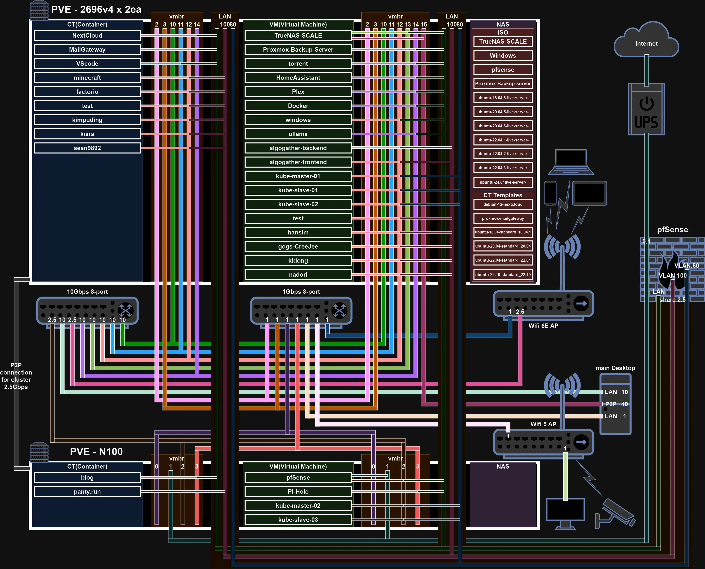
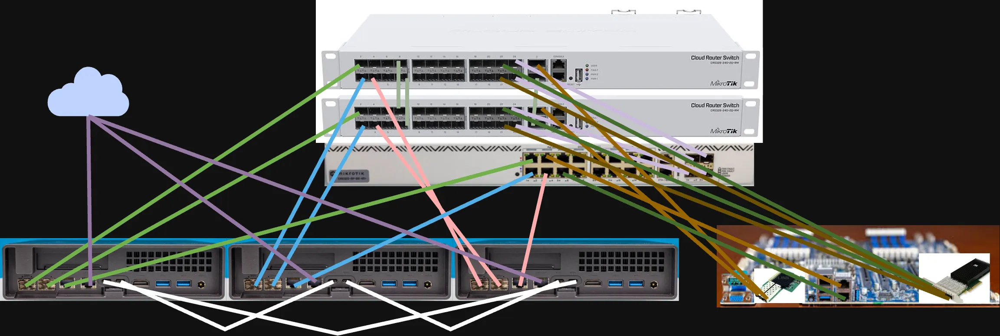
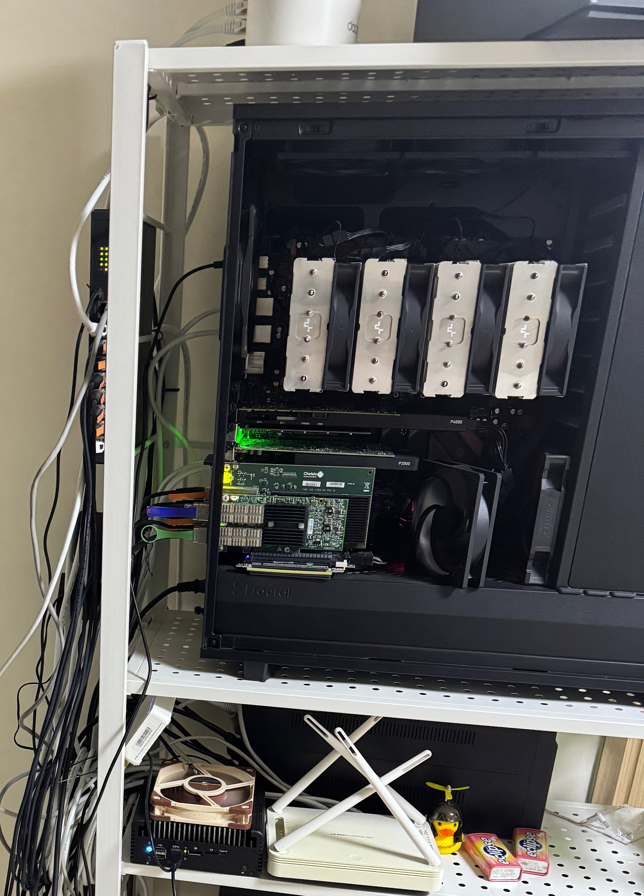
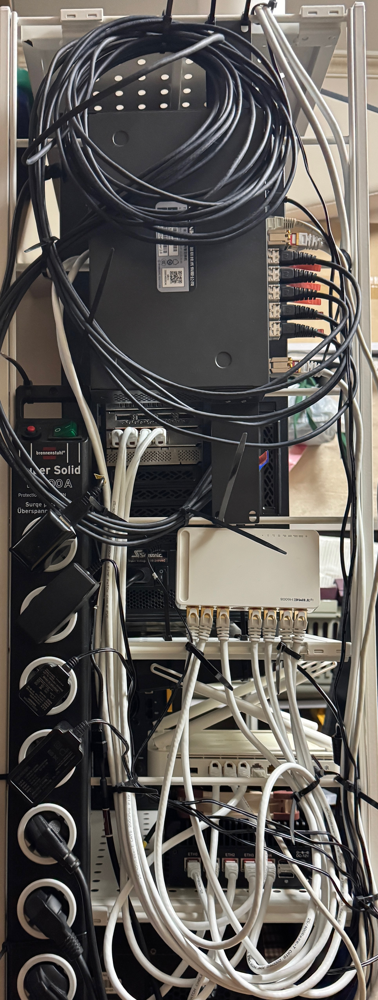

# 시작
2022년 11월경부터 본격적으로 홈서버를 운영한 지 벌써 2년하고도 반 정도가 지났다. 현재 홈서버의 구성에 대해서 살펴 보며 분석한 내용과 겪었던 실질적인 문제들을 바탕으로 새로운 서버 구성에 대한 큰 그림을 그려보고 지금까지의 경험을 정리해 보고자 한다.

# 1. 현재 구성과 문제점
서버의 보다 자세한 구성에 대한 설명은 [bbconf](https://bbconf.kr/)에서 발표했던 [내용](https://bbconfwebdav.vulcan.site/bbconf/2024-summer/%eb%b6%88%ec%b9%b8_%ed%99%88%ec%84%9c%eb%b2%84%201%eb%85%84%20%ec%82%ac%ec%9a%a9%ea%b8%b0%ec%99%80%20%ec%85%8b%ed%8c%85%ec%97%90%20%eb%8c%80%ed%95%b4%ec%84%9c.pdf)에 보다 자세히 적혀있다. 지금은 추가된 부분이 있지만 대략적인 부분은 큰 차이가 없다.

현재의 구성은 아래와 같다.

많은 VM, CT들을 운영하고 있는 메인 노드와 네트워킹, 모니터링, 관리 도구 등 운영에 꼭 필요하거나 서비스가 죽었을 때 치명적인 부분들을 담당하는 서브 노드 총 2개의 노드로 구성돼 있다. 이제부터 문제점을 하나씩 파악해 보자.

## 1.1. 단일 게이트웨이
지금까지 가장 많은 문제를 일으킨 SPOF이다. 서버 전체의 게이트웨이, 방화벽, DNS, DHCP, reverse proxy, VLAN등 대부분의 네트워크를 pfsense가 담당하고 있다. 때문에 pfsense VM이나 해당 VM이 구동되는 서브 노드가 다운되면 외부에서 서버 전체에 대한 접근 방법이 없어지고, 내부에서도 인터넷에 접속이 불가능해진다. pfsense자체를 업데이트할 때도 다운타임이 발생하지만, 이는 비교적 짧다. 문제는 pfsense는 호스팅하고있는 하이퍼바이저인 proxmox를 업데이트할 때다. proxmox의 업데이트 이후 재부팅은 비교적 오래 걸리고, 매끄럽게 진행되지 않을 경우 다운타임은 무제한으로 길어진다. 때문에 이 문제를 해결해야 하는데, 방법은 두 가지가 있다.
* pfsense의 HA 기능을 이용하는 것
* proxmox의 HA 기능을 이용하는 것

여기서 중요한 것은 두 방법 모두 2개 이상의 proxmox node가 필요하다는 것이다. pfsense의 HA 기능을 적절하게 활용하기 위해선 결국 서로 다른 proxmox node가 필요하고, 본격적인 proxmox HA 기능을 위해선 3개 이상의 node가 권장된다. 그럼 각각의 장단점에 대해서 살펴보자.
* pfsense의 HA 기능을 이용하는 것
    * 장점
        * 두 pfsense가 vrrp 패킷으로 서로의 생존을 확인하고 만약 active pfsense가 죽었을 때 standby pfsense가 바로 역할을 대신해서 다운타임을 최소화할 수 있다.
        * 대부분의 방화벽이나 게이트웨이가 이 방법을 사용한다.
    * 단점
        * 2개의 공인 IP가 필요하다. 보통의 통신사의 정책에선 추가 비용을 내지 않으면 공인 IP는 1개가 원칙이다. 그리고 내가 아직은 알지 못하는 DDNS에 대한 지식이 필요할 수 있다. 
        * 더블 NAT이 될 수 있다. 이는 구성의 불편함을 초래할 수 있다.
* proxmox의 HA 기능을 이용하는 것
    * 장점
        * pfsense의 HA 기능을 이용할 때의 단점을 생각하지 않아도 된다.
        * 다른 VM에도 proxmox HA 기능을 적용할 예정이기에 추가로 pfsense HA에 대해서 신경 쓰지 않아도 된다.
        * 조사에 따르면 ceph 스토리지를 바탕으로 적절한 HA구성을 한다면 live migration을 proxmox에서 지원하기 때문에 이 방법도 다운타임이 거의 없다.(ping 기준 1~5 ping 정도가 드랍된다는 영상을 발견했다.)
    * 단점
        * pfsense를 업데이트할 경우에 발생하는 다운타임은 해결할 수 없다.
        * proxmox HA 구성이 복잡하다.

이미 proxmox에 ceph를 이용해 HA가 제대로 작동하는 3 node cluster를 구축할 계획을 세웠기 때문에 사실상 가장 큰 단점이 없는 셈이나 마찬가지다. 그리고 pfsense의 업데이트로 인한 다운타임은 경험상 1분 이내이다. 때문에 들어오는 WAN을 단순한 스위치에 연결하고 이걸 다시 3개의 노드에 연결해 준다. pfsense VM이 migration되면서 같은 MAC 주소를 유지하기 때문에 같은 공인 IP로 연결되게 된다. 때문에 proxmox의 HA 기능을 이용해 게이트웨이의 다운타임을 최소화하기로 결정했다. 1년에 2~4회 정도 업데이트를 진행한다고 생각하면 연간 다운타임을 5분 이하로 유지할 수 있을 것으로 기대한다.

추가로 pfsense를 사용하면서 최신 드라이버에 대한 지원이 굉장히 느리다는걸 알았다. 최신 데비안 버전에도 올라간 드라이버가 이후에 진행된 pfsense의 업데이트에 포함되지 않는 경우도 있다. 때문에 비교적 업데이트가 빠른 opnsense로 migration하기로 결정했다.

## 1.2. 단일 스위치
현재는 10Gbps 8port switch를 사용하고 있다. 네트워크 케이블을 재배치하거나, 스위치를 업데이트할 때 필연적으로 다운타임이 발생할 수밖에 없다. 이것을 해결하고자 mikrotik switch를 이용해 multi chassis link aggregation을 구성하고, 각 노드에서 backup bond를 하나 더 구성해 각 switch의 실패뿐만 아니라 특정 nic의 다운에도 대응할 수 있게 구성하려고 한다.

## 1.3. 모니터링 부족
기존의 grafana를 구성할 때 InfluxDB를 이용해 모든 메트릭 데이터를 여기로 통합하려했는데 잘 되지 않았다. 때문에 InfluxDB와 Prometheus와 병용하고, 서버 전체로 흩어져있는 로그 또한 수집해서 모니터링 할 수 있도록 loki를 이용해서 로그도 수집할 예정이다.

## 1.4. 서비스의 파편화
[ansible semaphore](https://ansible.vulcan.site/), [zitadel](https://zitadel.vulcan.site/), [nextcloud](https://nextcloud.vulcan.site/), [netbird](https://nextcloud.vulcan.site/), [blog](https://vulcan.site/), [immich](https://immich.vulcan.site/), [grafana](https://grafana.vulcan.site/), [plex](https://plex.vulcan.site/), [open web ui](https://ollama.vulcan.site/), pihole 등 많은 서비스들을 운영하고 있다. 하지만 일부는 stand alone, 일부는 docker compose로 여러 VM에 걸쳐 분리돼서 관리되고 있다. 이를 최대한 하나의 노드에서 docker compose를 이용해 관리하는 방식으로 migration하고, 가능하다면 RKE2로 쿠버네티스를 구성해서 쿠버 클러스토로 이전하는 게 목표이다.

## 1.5. 단일 전원
기존의 구성에서는 1개의 UPS에 모든 기기들이 연결돼 있었다. 이는 UPS가 실패하거나, PDU가 실패하거나, 각 케이블에 문제가 생겼을 때 전체 시스템을 죽일 수 있다. 그리고 기존의 납축전지를 이용한 UPS의 경우 2~3년마다 배터리를 교체해야 하고 매우 무겁고 비싸다. 하지만 최근에 ecoflow에서 river 3, delta 3 시리즈부터 10ms 이내의 전환 시간을 가진 UPS기준에 부합하는 파워뱅크를 출시했고, NUT최신버전에서 해당 기기에 대한 지원을 시작했다. 그래서 이 기기를 이용해 2개의 UPS를 구성하고, 포트별 on/off 조절이 가능한 PDU를 사용해서 강제 전원 on/off 기능도 추가할 예정이다.

## 1.6. 단일 WAN
단일 게이트웨이도 문제지만 WAN이 하나라는 건 치명적이다. 내가 외부에 있을 때 문제가 생기면 접근할 수 있는 수단이 전혀 없기 때문이다. 그리고 새로운 메인 노드는 mz32-ar0보드를 사용해 내장 BMC가 있고, 서브 노드로 구매 예정인 기기들도 Intel vpro 기능을 지원해서 BIOS레벨에 원격으로 접근이 가능하다. 하지만 여전히 네트워크는 필요하고, vpro나 BMC에 문제가 생겼을 경우 원격 접속이 불가능해진다. 때문에 pikvm을 이용해 모든 노드에 2가지 수단으로 BIOS레벨에 원격 접속이 가능하게 설정하고, 4G 모뎀을 이용해서 완전히 분리된 관리망을 구성할 예정이다.

# 2. 새로운 구성
아래와 같이 새로운 구성을 할 예정이다.

## 2.1. 네트워크
맨 오른쪽은 메인 스토리지 서버이고 공유스토리지를 위한 NFS전용으로 40Gbps 2포트를 LAG해서 사용하고 10Gbps를 각각 2포트씩 LAG해서 한개는 대용량 스토리지 전용으로, 나머지는 LAN으로 사용한다. 3개의 서브 노드는 10Gbps 2포트를 LAG해서 사용하고 1개의 2.5Gbps는 백업 bond로 나머지 1개는 WAN으로 연결된다. 흰색으로 표시된 USB4 연결은 ceph 데이터 이동을 위한 ring network를 구성해 사용할 예정이다.

## 2.2. 스토리지
모든 노드는 일반적인 nvme ssd 2장을 mirror구성으로 부트드라이브로 사용한다. 서브 노드의 경우 ceph와 VM을 위해 높은 iops를 확보하고 내구성을 위해 intel optane을 달아줄 예정이다. 메인 노드는 대용량 스토리지로 18TB 14장을 6장씩 RAIDZ2로 묶고 묶인 풀 2개를 stripe해서 사용하고 남는 2개는 hot spare로 사용할 예정이다. 이렇게 구성하면 14개 중 8개가 가용량이고 252TB중 144TB를 사용할 수 있다. 이 하드디스크 풀의 메타데이터용으로 역시 intel optane 2장을 mirror로 구성하고 이 optane 풀의 일부를 하드디스크 풀의 SLOG로 사용해 풀 내부의 ZIL을 둬서 속도가 저하되는 걸 방지한다. 그리고 공유스토리지용으로 micron 7450 MAX 4장을 stripe mirror로 구성해 속도와 안정성 모두 확보할 예정이다. 이 SSD 풀은 HDD 풀에 백업하고 HDD풀은 현재 사용 중인 메인 서버에 하이퍼백업을 해서 중요한 데이터의 경우 321백업 원칙을 지킬 수 있도록 했다.

## 2.3. 소프트웨어
하이퍼바이저로는 proxmox를 그대로 사용하고, grafana를 비롯해 기존에 사용하던 것들을 migration해줄 예정이다. pfsense의 경우 상기한 이유로 opnsense로 변경할 예정이고, 추가로 uptimekuma, speed tester등을 도입해서 업타임이나 인터넷 속도 등도 모니터링 할 예정이다.

# 결론
2년 반 동안 현재의 서버에서 많은 서비스들을 운영해 보고 정말정말 많은 트러블슈팅을 하면서 많은 것을 배웠다. 이 지식을 바탕으로 더욱 발전된 홈서버를 설계하고 운영하면서 지금까지보다 더 많은 것을 배우고 성장할 수 있었으면 좋겠다. 그리고 새로운 서버를 구성하면서 지금까지 한번 했던 과정들을 반복하는 것들이 많다. 이것들을 튜토리얼로 정리해서 더 많은 사람이 홈서버에 쉽게 입문해서 같이 성장하고 재미를 느꼈으면 한다.

# 운영중인 외부 서비스
지인이나 bbonf를 위해 구동되고 있는 서비스들의 목록

https://panty.run/

https://poptile.firekann.dev/

https://bbconfwebdav.vulcan.site/bbconf/

http://ramzida.com/

# 이사
2월 초에 본가로 이사하면서 서버도 이사했다. 아래와 같은 배선을 모두 제거하고 이사해서 24시간 이내에 복구했다.

이사 전

이사 후
