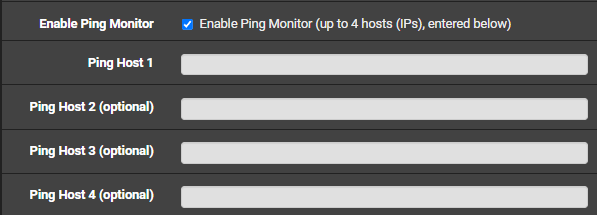

# 1 오류

pfSense CE 2.6 버전에서 2.7버전으로 업그레이드 한 이후로

```
PHP Fatal error: Uncaught TypeError: implode(): Argument #1 ($pieces) must be of type array, string given in /usr/local/pkg/telegraf.inc:132
Stack trace:
#0 /usr/local/pkg/telegraf.inc(132): implode(',', NULL)
#1 /etc/inc/pkg-utils.inc(709) : eval()'d code(1): telegraf_resync_config()
#2 /etc/inc/pkg-utils.inc(709): eval()
#3 /etc/rc.start_packages(66): sync_package('Telegraf')
#4 {main}
thrown in /usr/local/pkg/telegraf.inc on line 132
```

위와 같은 에러가 지속적으로 발생하는 것을 발견했다. 그리고 원래 상단바 Service -> Telegraf를 선택해서 telegraf 설정을 GUI로 관리할 수 있었는데, 이 Telegraf 선택지가 사라졌다. Telegraf는 pfSense에서 수집 정보들을 DB로 전송해 주는 역할을 한다. 하지만 이 오류가 발생하면 더 이상 telegraf가 작동하지 않는다. 하지만 telegraf를 한번 삭제한 이후에 pfSense를 재시작하고 재시작 직후 teletraf는설치하면 이전 설정대로 telegraf가 작동한다. 하지만 오류는 여전하고 GUI에의 접근 또한 불가능하다.

# 2 왜 이런 오류가 생겼을까?

## 2.1 오류가 발생한 코드

`telegraf.inc`파일에서 발생했다. 이 파일을 살펴보면 `telegraf_resync_config`작업을 수행하는데, 이는 설정값대로 `/usr/local/etc/telegraf.conf` 파일을 다시 동기화 해주는 코드가 작성돼 있다. 이 작업은 GUI에서 telegraf 설정값을 바꿨을 때, telegraf를 재설치 했을 때 동작한다. (추가로 다른 조건이 있을 수 있지만 이 두 조건은 확실하다.)

먼저 error가 발생한 코드를 살펴보도록 하자. pfSense의 Edit File을 통해 살펴볼 수 있다.

```PHP
//      /usr/local/pkg/telegraf.inc
        /* Ping Monitor Configuration */
        if ($telegraf_conf["ping_enable"]) {
                if (!empty($telegraf_conf['ping_host_1'])) {
                        $monitor_hosts[] = '"' . $telegraf_conf["ping_host_1"] . '"';
                }
                if (!empty($telegraf_conf['ping_host_2'])) {
                        $monitor_hosts[] = '"' . $telegraf_conf["ping_host_2"] . '"';
                }
                if (!empty($telegraf_conf['ping_host_3'])) {
                        $monitor_hosts[] = '"' . $telegraf_conf["ping_host_3"] . '"';
                }
                if (!empty($telegraf_conf['ping_host_4'])) {
                        $monitor_hosts[] = '"' . $telegraf_conf["ping_host_4"] . '"';
                }

                $monitor_hosts = implode(",", $monitor_hosts);      // line 132

                $cfg .= "\n[[inputs.ping]]\n";
                $cfg .= "\turls = [" . $monitor_hosts . "]";
                $cfg .= "\n\tdeadline = 0\n\n"; /* deadline (-w) function not supported in BSD ping */
        }
```

오류가 발생한 라인의 코드를 살펴보면 `$telegraf_conf`에서 `ping_host_*`의 값들을 가져와서 아래와 같은 형태로 만들어준다.

```
[[inputs.ping]]
	urls = ["host.1.ip.addr","host.2.ip.addr","host.3.ip.addr","host.4.ip.addr"]
	deadline = 0
```

이 부분은 telegraf가 ping메세지를 지정된 IP로 보내고 결과를 받아 목표로하는 서버가 살아있는지 확인할 수 있게 해줍니다. 필수적인 사항은 아니고, pfSense의 telegraf 설정에서 비활성화할 수 있다.

## 2.2 오류가 발생한 곳

error 메시지에서는 `telegraf.inc`의 line 132에서 `implode(',', NULL)`때문에 error가 발생했음을 알 수 있다. `telegraf.inc`파일의 line 132를 보면 `$monitor_hosts = implode(",", $monitor_hosts);`라는 코드가 있는데, 여기서 `$monitor_hosts`가 `NULL`이라는 것이다. 왜 그럴까? 먼저 line 132 이전에 if 문에서 `ping_host_*`값들을 `$monitor_hosts` array에 추가해 주는 것을 알 수 있다. 그런데 만약 `telegraf_conf`에 `ping_host_*`값이 없다면? `$monitor_hosts`에는 아무것도 들어가지 않을 것이다. PHP에서는 변수가 명시적으로 초기화되지 않아도 사용될 때 자동으로 생성된다. 그러나 변수가 명시적으로 초기화되지 않은 경우 해당 변수는 `NULL` 값을 가질 수 있다. 때문에 if문을 지나면서 한 번도 조건을 만족하지 못했다면 `$monitor_hosts`는 `NULL`이 될 수 있다.

pfSense CE 2.7은 PHP 8버전을 사용한다. PHP 8버전에서는 `implode`를 `NULL` 값과 함께 호출하는 것이 허용되지 않는다. 때문에 `implode(',', NULL)`과 같은 형식은 error를 발생시킨다.

## 2.3 왜 업그레이드 이후에 에러가 발생했을까?

pfSense CE 2.7 업그레이드 노트를 살펴보면 PHP 버전이 7.4.X 버전에서 8.2.6 버전으로 업그레이드된 것을 알 수 있다. PHP 7버전에서는 `implode`를 `NULL` 값과 함께 호출하는 것이 허용됐다. 구현에 따라 `implode`의 반환 값이 `NULL` 또는 빈 문자열이 된다. 때문에 `$monitor_hosts`에 아무것도 들어가지 않았다고 하더라도 error가 발생하지 않는다.

하지만 위에서 설명한 것과 같이 PHP 8버전에서는 더 엄격한 type검사를 시행하고, 때문에 `implode`를 `NULL` 값과 함께 호출하면 error가 발생한다. 그 때문에 pfSense 2.6에서 2.7버전으로 업그레이드를 하면서, PHP 버전이 8버전으로 업그레이드됐고, 이것이 문제를 일으킨 것이다.

## 2.4 이것은 왜 방지되지 않았을까?

우선 telegraf는 urls가 비어있다고 하더라도 아무런 문제 없이 동작한다. `telegraf/plugins/inputs/ping/ping.go`을 보자.

```go
func (p *Ping) Gather(acc telegraf.Accumulator) error {
	for _, host := range p.Urls {
		p.wg.Add(1)
		go func(host string) {
			defer p.wg.Done()

			switch p.Method {
			case "native":
				p.pingToURLNative(host, acc)
			default:
				p.pingToURL(host, acc)
			}
		}(host)
	}

	p.wg.Wait()

	return nil
}
```

여기서 ping을 시도한다. 여기서 `p.Urls`가 비어있다고 하더라도, ping작업을 수행하지 않을 뿐 문제는 생기지 않는다. `p.wg.Add(1)`과 `p.wg.Done()`역시 호출되지 않기에 `p.wg.wait()`이 즉시 호출됩니다. 그 때문에 동기화 문제도 발생하지 않는다.

지금은 pfSense의 Telegraf 설정에서 `Enable Ping Monitor`옵션을 켜고 `Ping Host`에 아무것도 적지 않고 저장하면 아래와 같은 Crash Report를 내보낸다.

```
PHP Fatal error:  Uncaught TypeError: implode(): Argument #1 ($array) must be of type array, string given in /usr/local/pkg/telegraf.inc:132
Stack trace:
#0 /usr/local/pkg/telegraf.inc(132): implode()
#1 /usr/local/www/pkg_edit.PHP(245) : eval()'d code(1): telegraf_resync_config()
#2 /usr/local/www/pkg_edit.PHP(245): eval()
#3 {main}
  thrown in /usr/local/pkg/telegraf.inc on line 132
```

하지만 이것은 위에서 서술한 PHP error가 발생해서 나온 Crash Report일 뿐이지, pfSense에서 Telegraf 설정 GUI에서 Save를 눌렀을 때 pfSense가 자체적으로 format을 검증하고 에러를 내는 것이 아니다. 그 때문에 pfSense CE 2.6버전에서는 Crash Report 없이 정상적으로 저장됐을 것이다.

Ping Host는 입력하는 창은 아래와 같이 돼 있다.


여기서 분명 `Ping Host 1`은 `(optional)`표시가 없다. 그런데 비우고 저장해도 pfSense에서는 경고를 보내지 않는다. pfSense 2.7버전 이전에 `Enable Ping Monitor` 옵션을 켜고 `Ping Host`에 아무것도 적지 않고 저장한 사람들은 모두 같은 오류가 발생했을 것이다. 또한 이 오류에 대해서 여러 버그 리포트를 봤는데, 많은 사람들은 해당 문제를 재현하지 못했다고 말하고 있었다. 이것은 아마도 `Enable Ping Monitor` 옵션이 꺼진 상태에서 pfSense 2.6에서 2.7버전으로 업그레이드했기 때문에 문제가 발생하지 않았을 것으로 생각된다.

# 3 어떻게 해결할까?

## 3.1 Ping Host에 IP 추가

위에서 설명했듯이 `Ping Host`에 IP가 하나도 들어있지 않아서 발생하는 문제다. 때문에 `Ping Host`에 한 개 이상 IP를 추가하면 오류를 해결할 수 있다. 그런데 앞서 [1 오류](#1-오류)에서 "GUI로 관리할 수 있었는데, 이 Telegraf 선택지가 사라졌다."라고 했다. 그럼 어떻게 설정을 수정할 수 있을까?

pfSense는 `/conf/config.xml`이 모든 package들의 configuration이 저장된다. 이 파일을 열어보면 `<telegraf>`에 `<ping_host_1></ping_host_1>`항목이 있다. 여기에 아래와 같이 IP를 추가하고 저장해주면 된다.

```xml
<ping_host_1>db.server.ip.addr</ping_host_1>
```

## 3.2 Ping Monitor 옵션 비활성화

위에 [코드](#21-오류가-발생한-코드)를 살펴보면 `if ($telegraf_conf["ping_enable"]) {`여기에 `ping_enable`옵션이 켜져 있는지 확인하는 코드가 있다. 만약 Ping Monitor 옵션이 커져있다면, 문제가 되는 line 132 또한 실행되지 않을 것이다. 이 또한 `/conf/config.xml`에 `<ping_enable>on</ping_enable>`항목이 있다. 여기서 아래와 같이 `on`을 지워주면 Ping Monitor 옵션을 비활성화한 것이다.

```xml
<ping_enable></ping_enable>
```

이것으로 오류를 해결할 수 있다.

## 3.3 telegraf.inc 변경

처음에는 문제의 근본적인 원인인 `telegraf.inc` 파일을 변경해서 해결할 수 있다고 생각했다. 하지만 `telegraf.inc` 파일은 package를 재설치하거나 pfSense를 재부팅할 때 다시 서버에서 가져온다. 그 때문에 수정은 영구적이지 않다. 또한 `telegraf.inc` 파일을 수정하고 해당 패키지를 재실행할 방법 또한 마땅치 않다. 하지만 근본적으로는 이 부분이 해결돼야 한다.

```PHP
        /* Ping Monitor Configuration */
        if ($telegraf_conf["ping_enable"]) {
                $monitor_hosts = array();
                if (!empty($telegraf_conf['ping_host_1'])) {
                        $monitor_hosts[] = '"' . $telegraf_conf["ping_host_1"] . '"';
                }
                if (!empty($telegraf_conf['ping_host_2'])) {
                        $monitor_hosts[] = '"' . $telegraf_conf["ping_host_2"] . '"';
                }
                if (!empty($telegraf_conf['ping_host_3'])) {
                        $monitor_hosts[] = '"' . $telegraf_conf["ping_host_3"] . '"';
                }
                if (!empty($telegraf_conf['ping_host_4'])) {
                        $monitor_hosts[] = '"' . $telegraf_conf["ping_host_4"] . '"';
                }

                if (!empty($monitor_hosts)) {
                    $monitor_hosts = implode(",", $monitor_hosts);      // line 132

                    $cfg .= "\n[[inputs.ping]]\n";
                    $cfg .= "\turls = [" . $monitor_hosts . "]";
                    $cfg .= "\n\tdeadline = 0\n\n"; /* deadline (-w) function not supported in BSD ping */
                }
        }
```

위와 같이 `$monitor_hosts`를 `array()`로 초기화하고 빈 배열인지 확인하고 다음 과정을 진행하면 될 것이다.

이 해결 방법을 떠올리고 해당 패키지에 기여를 하고 싶어서 검색하다 pfSense package 저장소를 발견했는데, 완전히 같은 방법으로 이미 해결돼 있어서 놀랐다. 조금 더 관심을 두고 빨리 해결하고자 했으면 좋았을 것 같다. 또한 pfSense CE 2.8.0, pfSense Plus 24.08버전에서는 해당 패치가 포함돼 문제가 해결될 것 같다.

# 후기

이 문제는 pfSense CE 2.7버전 업데이트 직후 부터 보고됐었다. 하지만 그동안 해결 방법이 알려지지 않았고, 최근에 발견한 이 [문서](https://redmine.pfSense.org/issues/14861) 이외에는 해결 방법을 찾을 수 없었다. 그리고 해당 문서에서 또한 친절한 해결 절차에 대해서는 쓰여있지 않았다. 때문에 이 글을 작성하게 됐다. 같은 오류로 많은 스트레스를 받은 사람들이 이 글로 오류를 해결했기를 바란다.

이 글에는 표현이 이상하거나 틀린 내용이 있을 수 있습니다. 모든 지적은 환영합니다.

# 참고

-   [telegraf inputs.ping](https://github.com/influxdata/telegraf/tree/master/plugins/inputs/ping)
-   [PHP implode](https://www.PHP.net/manual/en/function.implode.PHP)
-   [PHP manual Backward Incompatible Changes](https://www.PHP.net/manual/en/migration80.incompatible.PHP)
-   [pfSense CE 2.7 upgrade note](https://docs.netgate.com/pfSense/en/latest/releases/2-7-0.html)
-   [pfSense issues](https://redmine.pfSense.org/issues/14861)
