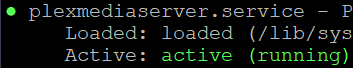

# 0. 마이그레이션을 하게 된 이유

지금까지 Plex 미디어 서버를 영상, 노래 스트리밍 용도로 잘 활용해 왔다. 다만 서버의 CPU는 Xeon이기 때문에 내장그래픽은 당연히 없고 설치되어 있는 QUADRO® P4000은 주로 Stable Diffusion이나 기타 작업을 할 때 여러 가상머신에서 사용하기 때문에 Plex의 하드웨어 트랜스코더로 사용하기에는 적절하지 않다. 그리고 보유하고 있는 미디어들이 점점 증가하면서 메타데이터의 용량이 늘어나게 되었고, 기존에 Plex가상머신에 할당해 두었던 20GB가 가득 차게 되었다. 때문에 중고 QUADRO® P2000을 구매하여 이를 이용해 하드웨어 트랜스코더로 이용해서 Plex서버를 마이그레이션 해보고자 한다.

나는 proxmox 위에서 돌아가는 ubuntu 20.04가상머신에서 해당 내용을 진행했다. 하지만 다른 OS도 진행은 크게 다르지 않다.

# 1. 준비

-   먼저 구동되고 있던 Plex 서버의 웹 gui에서 설정 > 라이브러리 > "변경사항이 발견될때 부분적인 스캔 실행"을 체크 해제해 준다.
-   로그아웃 해줍니다.
-   Plex 미디어 서버가 구동되고 있는 머신에서 Plex를 종료해 준다.

```sh
sudo systemctl stop plexmediaserver.service         #서비스 종료
sudo systemctl status plexmediaserver.service       #종료 상태 확인
```

active상태가 아니면 종료된 상태이다.



# 2. 새로운 Plex Media 서버 설치

-   마이그레이션 할 대상 서버에 Plex Media 서버를 설치해 준다.

```sh
echo deb https://downloads.plex.tv/repo/deb public main | sudo tee /etc/apt/sources.list.d/plexmediaserver.list
curl https://downloads.plex.tv/plex-keys/PlexSign.key | sudo apt-key add
sudo apt update && upgrade
sudo apt install plexmediaserver
```

-   설치가 되었는지 확인한다. 위의 이미지처럼 active상태면 설치가 된 상태이다.

```sh
sudo systemctl status plexmediaserver.service       #서비스 상태 확인
```

-   서버에 로그인만 해주고 로그아웃하고 종료해 줍니다.

```sh
sudo systemctl stop plexmediaserver.service         #서비스 종료
sudo systemctl status plexmediaserver.service       #종료 상태 확인
```

# 3 서버 데이터 복사

-   마이그레이션 할 대상 서버에 기존 서버와 똑같은 위치에 미디어들을 이동시켜 줍니다. cifs같은 경우라면 같은 위치에 마운트 해줍니다.
-   이후에 `Plex Media Server`를 기존 서버에서 대상 서버로 이동시켜 줍니다.

```sh
sudo rsync -avzhP USERNAME@기존_서버_IP:/var/lib/plexmediaserver/Library/Application\ Support/Plex\ Media\ Server /var/lib/plexmediaserver/Library/Application\ Support/
```

-   전송이 완료되면 재부팅해 줍니다.

```sh
sudo reboot                                         #서비스 시작
sudo systemctl status plexmediaserver.service       #active상태 확인
```

# 4 최종 확인

-   Plex 서버의 웹 gui에 로그인해서 라이브러리 스캔을 해줍니다.
-   마이그레이션 완료!

# 참고

https://support.plex.tv/articles/201370363-move-an-install-to-another-system/
