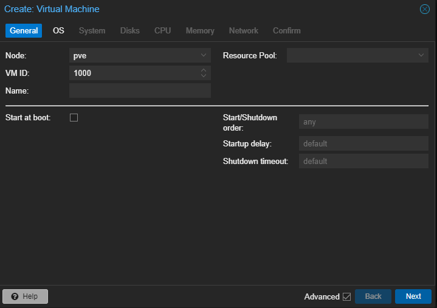
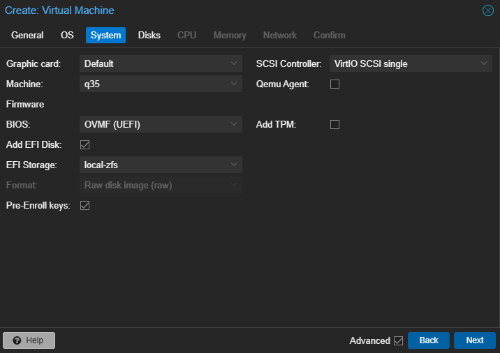
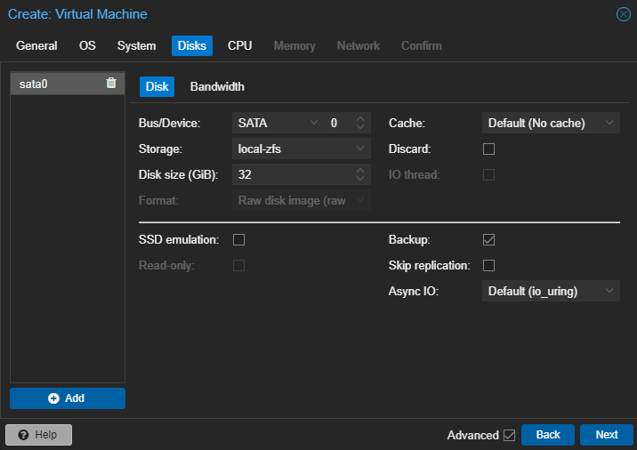
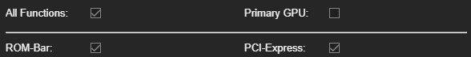
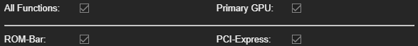
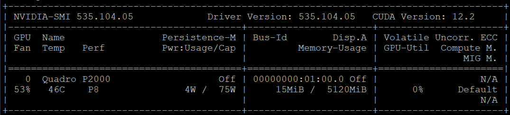

# 0 환경

-   자세한 서버의 하드웨어는 [블로그 첫 글](https://vulcan.site/first_article/)을 참고하시기 바랍니다.
-   PVE 7.4-16버전, 가상머신은 ubuntu-server 20.04버전입니다.
-   nvidia GPU로 테스트했습니다. 다른 제조사의 GPU의 경우 방법이 다를 수 있습니다.
-   메인보드의 BIOS에서 Passthrough와 관련된 셋팅이 돼있어야 합니다.

# 1 PVE 설정

```sh
nano /etc/default/grub      #grub 파일 수정
```

아래의 내용을 추가해 준다.

```
GRUB_CMDLINE_LINUX_DEFAULT="quiet intel_iommu=on iommu=pt pcie_acs_override=downstream,multifunction nofb nomodeset video=vesafb:off,efifb:off,pci=noaer,pci=nommconf"
```

```sh
update-grub                 #grub 업데이트
nano /etc/modules           #modules 파일 수정
```

아래 내용을 추가해 준다.

```
vfio
vfio_iommu_type1
vfio_pci
vfio_virqfd
```

```sh
nano /etc/modprobe.d/blacklist.conf     #blacklist.conf 파일 수정
```

아래 내용을 추가해 준다.

```
blacklist nouveau
blacklist nvidia
blacklist radeon
```

-   vfio 정보를 등록해준다.

```sh
lspci -v | grep NVIDIA              #00:00 형식의 값을 찾는다.
lspci -n -s 00:00                   #xxxx:xxxx 형식의 값을 찾는다.
nano /etc/modprobe.d/vfio.conf      #vfio.conf 파일 수정
```

아래 내용을 추가해 준다.

```
options vfio-pci ids=xxxx:xxxx,xxxx:xxxx disable_vga=1
```

```sh
update-initramfs -u     #initramfs 업데이트
reboot                  #재부팅
```

# 2 VM 설정

## 부팅 전 설정

Create VM 창을 기준으로 설명



-   System
    -   Machine : q35
    -   BIOS : OVMF (UEFI)
    -   EFI Storage를 설정해준다.



-   Disks
    -   Bus/Device : SATA



-   Hardware - Add - PCI Device - 원하는 GPU를 선택
    -   All functions : 체크
    -   Primary GPU : 체크 해제
    -   ROM-Bar : 체크
    -   PCI-Express : 체크



이후 우분투 서버를 설치해주고 SSH에 접속할 수 있는 환경을 만들어두고 IP를 기억해두자.

## 부팅 후 설정

먼저 VM을 꺼준다.

```sh
nano /etc/pve/qemu-server/000.conf      #000.conf 파일 수정 000은 VM ID이다.
```

아래 내용을 추가해 준다.

```
cpu: host,hidden=1
```

-   GPU ROM dump

```sh
cd /sys/bus/pci/devices/0000:00:00.0/   #0000:00:00.0에서 00:00부분에 이전에 lspci에서 썼던 번호를 쓴다.
echo 1 > rom
cat rom > /tmp/image00.rom              #image00.rom에서 00부분에 이전에 lspci에서 썼던 번호를 쓴다.
echo 0 > rom
cd ~/NVIDIA-vBIOS-VFIO-Patcher
python nvidia_vbios_vfio_patcher.py -i /tmp/image00.rom -o /tmp/image00.patched.rom --disable-footer-strip
#image00.rom에서 00부분에 이전에 lspci에서 썼던 번호를 쓴다.
```

-   ROM 파일 복사

```sh
cp /tmp/image00.pached.rom /usr/share/kvm/gpu00.pached.rom  #00부분에 이전에 lspci에서 썼던 번호를 쓴다.
nano /etc/pve/qemu-server/000.conf      #000.conf 파일 수정 000은 VM ID이다.
```

아래 내용을 추가해 준다.

-   00부분에 이전에 lspci에서 썼던 번호를 쓴다.

```
hostpci0: 0000:00:00,pcie=1,x-vga=1,romfile=gpu00.patched.rom
```

-   Hardware - PCI Device
    -   All functions : 체크
    -   Primary GPU : 체크
    -   ROM-Bar : 체크
    -   PCI-Express : 체크



## 드라이버 설치

VM을 켜준다.

```sh
sudo apt update && upgrade
lshw -C display     #GPU확인
sudo apt install nvidia-driver-535      #GPU에 맞는 버전의 드라이버 설치
sudo apt update && upgrade
sudo reboot         #재부팅
nvidia-smi
```

아래의 이미지가 뜬다면 성공한것이다.



# 오류

오류가 나면 아래 스크립트를 실행하고 위의 내용을 진행해준다.

```sh
echo 1 > /sys/bus/pci/devices/0000\:00\:00.0/remove     #0000:00:00.0에서 00:00부분에 이전에 lspci에서 썼던 번호를 쓴다.
echo 1 > /sys/bus/pci/rescan
```
