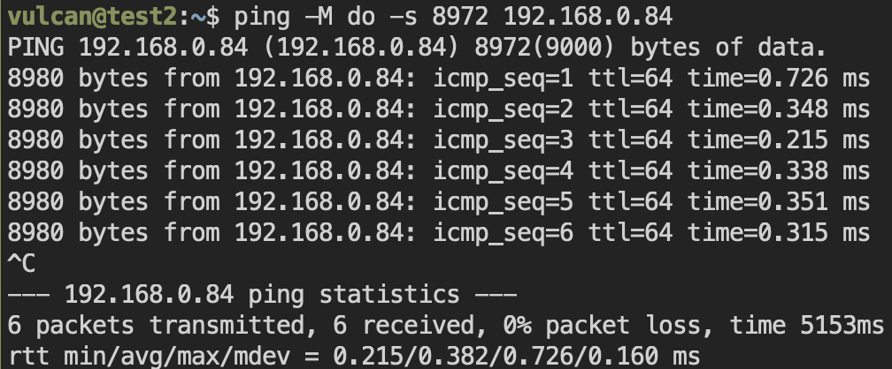
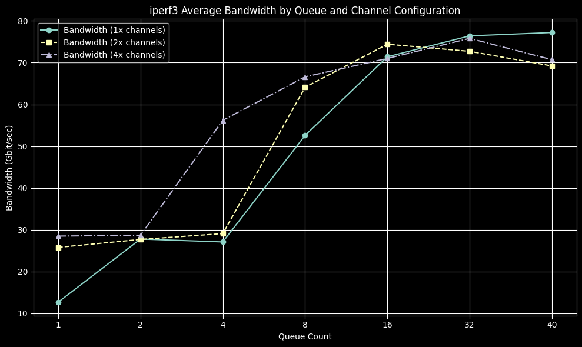
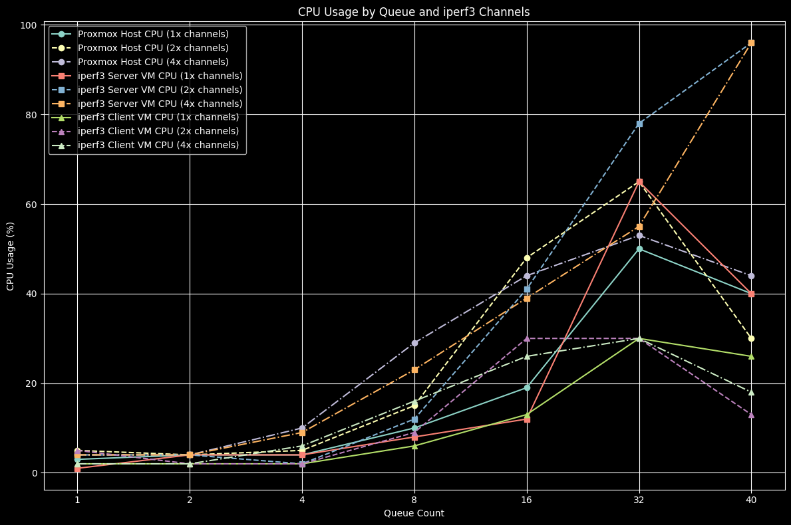

# 시작
Proxmox에서 보통 VM이나 CT에 네트워크를 할당할 때는 linux bridge를 사용한다. nic의 포트를 linux brige에 할당해서 사용하거나 같은 linux bridge에서 여러 VM이 통신을 할 수 있다. 여기서 nic의 포트 밖으로 나가지 않는 트래픽은 linux bridge에서 처리하는데 이 경우 host의 cpu가 처리하게 된다. 이 cpu는 네트워크 브릿징에 최적화된 칩이 아니기 때문에 속도에 제약이 발생할 수밖에 없다. 이 글에서는 proxmox의 linux bridge에서 내부적으로 낼 수 있는 최대 대역폭이 얼마인지를 테스트해 보려고 한다. (이 속도는 사용하는 cpu의 종류, 클럭에 따라 다를 수 있다.)

# 환경
* 하드웨어 : AMD EPYC Milan 7T83, 2933Mhz 채널당 2 dimm
* proxmox version : proxmox-ve: 8.4.0 (running kernel: 6.8.12-9-pve)
* Test VM : 42 core, 128GB
* MTU : 9000
아래와 같이 MTU가 바르게 설정됐는지 확인할 수 있다.


# 1. 테스트 개요
테스트의 주요 목표는 다음과 같다:
* vmdr Multiqueue 값 조정: Proxmox VM 내 네트워크 인터페이스의 multiqueue 수를 1, 2, 4, 8, 16, 32, 40으로 순차적으로 변경하여 테스트 진행
* iperf3 병렬 채널 구성: 각 multiqueue 값에 대해 iperf3 테스트 채널 수를
    * 기본 (1배): 현재 queue 수와 동일
    * 2배: 현재 queue 수의 두 배
    * 4배: 현재 queue 수의 네 배
    
        로 설정하여 성능 비교
* 성능 분석: 각 테스트 단계별로 네트워크 throughput, 지연 시간, 패킷 손실 및 CPU 부하 등을 측정하여 최적의 설정을 도출

# 2. 테스트 스크립트
```sh
#!/bin/bash
if [ "$#" -ne 1 ]; then
    echo "Usage: $0 <queue_number>"
    exit 1
fi

QUEUE="$1"
SERVER_IP="192.168.0.84"
TEST_TIME=30
OUTPUT_FILE="queue_${QUEUE}.txt"

if [ -f "$OUTPUT_FILE" ]; then
    rm -f "$OUTPUT_FILE"
fi

for MULT in 1 2 4; do
    CHANNELS=$(( QUEUE * MULT ))
    echo "==========================" | tee -a "$OUTPUT_FILE"
    echo "채널 수: ${CHANNELS} (입력 queue: ${QUEUE}, multiplier: ${MULT})" | tee -a "$OUTPUT_FILE"
    echo "테스트 시작: $(date)" | tee -a "$OUTPUT_FILE"
    echo "--------------------------" | tee -a "$OUTPUT_FILE"

    iperf3 -c "$SERVER_IP" -P "$CHANNELS" -t "$TEST_TIME" >> "$OUTPUT_FILE" 2>&1

    echo "테스트 종료: $(date)" | tee -a "$OUTPUT_FILE"
    echo "" | tee -a "$OUTPUT_FILE"
    echo "" | tee -a "$OUTPUT_FILE"

    sleep 5
done

echo "테스트 완료. 결과는 ${OUTPUT_FILE} 파일을 확인하세요."
```

# 3. 테스트 결과
자세한 결과는 [여기](https://github.com/firekann/vulcan.site/tree/master/content/blog/proxmox-vmbr-01)의 파일을 확인하자.
| Queue | 채널 수 | 대역폭 (Gbit/sec) | Server VM CPU (%) | Proxmox CPU (%) | Client VM CPU (%) |
|-------|---------|-------------------|-------------------|-----------------|-------------------|
| 1     | 1       | 12.7             | 1                 | 3               | 2                 |
| 1     | 2       | 25.8             | 4                 | 5               | 5                 |
| 1     | 4       | 28.5             | 4                 | 4               | 2                 |
| 2     | 2       | 27.8             | 4                 | 4               | 2                 |
| 2     | 4       | 27.7             | 4                 | 4               | 2                 |
| 2     | 8       | 28.7             | 4                 | 4               | 2                 |
| 4     | 4       | 27.1             | 4                 | 4               | 2                 |
| 4     | 8       | 29.1             | 2                 | 5               | 2                 |
| 4     | 16      | 56.2             | 9                 | 10              | 6                 |
| 8     | 8       | 52.6             | 8                 | 10              | 6                 |
| 8     | 16      | 64.1             | 12                | 15              | 9                 |
| 8     | 32      | 66.6             | 23                | 29              | 16                |
| 16    | 16      | 71.4             | 12                | 19              | 13                |
| 16    | 32      | 74.4             | 41                | 48              | 30                |
| 16    | 64      | 71.0             | 39                | 44              | 26                |
| 32    | 32      | 76.4             | 65                | 50              | 30                |
| 32    | 64      | 72.7             | 78                | 65              | 30                |
| 32    | 128     | 75.8             | 55                | 53              | 30                |
| 40    | 40      | 77.2             | 40                | 40              | 26                |
| 40    | 80      | 69.2             | 96                | 30              | 13                |
| 40    | 128     | 70.7             | 96                | 44              | 18                |
* 40 * 4의 경우 160으로 iperf3의 최대 채널 수 128을 초과하기에 128로 낮춰서 테스트했음.





# 4. 테스트 분석
그래프 분석
그래프는 각 Queue 및 iperf3 채널 수에 따른 대역폭과 CPU 사용량 변화를 보여준다.

대역폭
* Queue 값이 증가할수록 대역폭이 증가하였으나, Queue가 16을 넘어서면 약 70~77Gbps 수준에서 포화 상태를 보인다.

특히 Queue 8에서 16채널(64.1Gbps)을 사용할 때 가장 효율적으로 대역폭이 증가하는 구간을 확인할 수 있다.

CPU 사용량
* Proxmox와 VM의 CPU 사용률은 Queue 및 채널 수 증가와 함께 급격히 증가한다.

특히 Queue 32 이상, 채널 수가 Queue의 2~4배인 경우 VM 및 Proxmox CPU 부하가 상당히 높아졌다.

결과적으로 multiqueue를 너무 높이 설정하면 얻는 성능 증가 대비 CPU 자원 소모가 너무 높아진다.
특히 multiqueue가 8인 설정에서 좋은 성능과 적절한 CPU 자원 활용률을 보였다.

나는 multiqueue를 조정해서 VM에 올린 TrueNAS와 proxmox간의 NFS연결에서 충분한 대역폭을 확보하고 싶었다. NFS의 마운팅 옵션에서 최대 16개의 커넥션을 설정할 수 있으므로 multiqueue를 8 ~ 16 정도로 설정하면 적당할 것 같다. 다음 글에서는 VM간의 실질적인 NFS 속도를 테스트해 보려고 한다.

이 글이 Proxmox를 운영하거나 네트워크 성능을 최적화하려는 사용자들에게 좋은 참고 자료가 되길 바란다.

잘못된 설명이나 추가로 설명했으면 좋겠는 부분, 오타, 맞춤법에 대한 지적은 언제나 환영합니다.

* 이 글을 홈서버 사용자를 위한 것입니다. 틀린 내용이 있을 수 있고, 각자의 상황에 따라 데이터가 달라질 수 있습니다.
* 이 글을 포함해 인터넷에 존재하는 코드, 스크립트를 복사해 사용할 때는 코드, 스크립트를 충분히 읽고, 분석하여 문제가 없는지 확인하시기를 바랍니다. 최소한 ChatGPT 같은 AI에 해당 코드, 스크립트가 정말 안전하고 사용해도 되는지 확인받으시길 권장합니다.