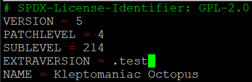
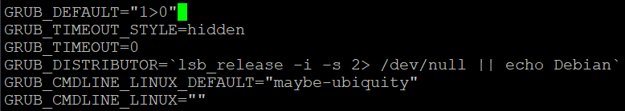
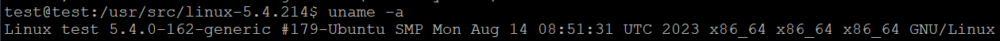
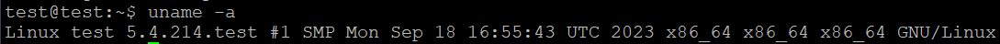

# 0 시작하기에 앞서

이 글을 쓰게 된 이유는 학교에서 현재 "리눅스 시스템 응용 설계"라는 과목을 수강하고 있기 때문이다. 이 과목에서는 당연히 수없이 많은 커널 컴파일을 해야 할 수 있고, 때문에 그 과정을 간단하게 정리하고자 글을 썼다.

-   [블로그 첫 글](https://vulcan.site/first_article/)을 보면 알겠지만 나는 44core 시스템을 보유하고 있다. 보통의 경우 커널 컴파일은 굉장히 오래 걸릴 수도있으니, 여유를 가지고 진행하자.

# 1 우분투 설치

-   VirtualBox나 듀얼부팅으로 ubuntu 서버 버전 혹은 데스크탑 버전을 설치해준다. 이외에 본인이 편한 환경에 설치해주면 된다.
-   디스크 용량은 40GB 이상으로 설정해주자.
-   작업을 편하게 하기 위해 SSH 접속 환경을 셋팅해준다.
-   커널을 설치하기 이전에 업데이트를 해준다.
-   이후 현재 커널 버전을 확인해준다.

```sh
sudo apt update && upgrade      #업데이트
uname -a                        #커널 버전 확인
```

# 2 커널 다운로드

-   https://mirrors.edge.kernel.org/pub/linux/kernel/ 해당 사이트에서 원하는 버전의 커널을 다운받는다.
-   강의에서 5.4.214버전을 사용하기 때문에 해당 버전으로 진행하겠다.

```sh
cd /usr/src/
sudo wget https://mirrors.edge.kernel.org/pub/linux/kernel/v5.x/linux-5.4.214.tar.gz    #다운로드
sudo tar -xzvf linux-5.4.214.tar.gz     #압축 해제
sudo cp linux-headers-5.4.0-162-generic/.config linux-5.4.214   #config 파일 복사
```

-   config 수정

```sh
cd linux-5.4.214/
sudo nano .config   #config 파일 수정
#아래 두 줄을 수정해준다.
#CONFIG_SYSTEM_TRUSTED_KEYS="debian/canonical-certs.pem" -> CONFIG_SYSTEM_TRUSTED_KEYS = ""
#CONFIG_SYSTEM_REVOCATION_KEYS="debian/canonical-certs.pem" -> CONFIG_SYSTEM_REVOCATION_KEYS=""
```

-   필요 패키지 설치

```sh
sudo apt install build-essential libncurses5 libncurses5-dev bin86 kernel-package libssl-dev bison flex libelf-dev dwarves  #필요 패키지 설치
sudo reboot     #재부팅
```

-   menuconfig

```sh
cd /usr/src/linux-5.4.214/
sudo make menuconfig
```

load -> ok -> exit -> yes

-   커널 이름 변경 (optional)

```sh
sudo nano Makefile
```



# 3 커널 컴파일

-   코어 수 확인

```sh
grep -c processor /proc/cpuinfo     #176
```

-   compile

```sh
sudo make -j176
sudo make modules_install
sudo make install
```

# 4 kernel 변경

-   Boot kernel 순서 확인

```sh
awk -F\' '/menuentry / {print $2}' /boot/grub/grub.cfg
```

```
test@test:/usr/src/linux-5.4.214$ awk -F\' '/menuentry / {print $2}' /boot/grub/grub.cfg
Ubuntu                                                  ---->> 1
Ubuntu, with Linux 5.4.214.test                         ---->> 1>0
Ubuntu, with Linux 5.4.214.test (recovery mode)         ---->> 1>1
Ubuntu, with Linux 5.4.0-162-generic                    ---->> 1>2
Ubuntu, with Linux 5.4.0-162-generic (recovery mode)    ---->> 1>3
```

```sh
sudo nano /etc/default/grub     #grub 파일 수정
```



```sh
sudo update-grub                #grub 업데이트
sudo reboot                     #재부팅
```

# 5 kernel 변경 확인

```sh
uname -a
```

커널 버전이 잘 변경된 것을 확인할 수 있다.



